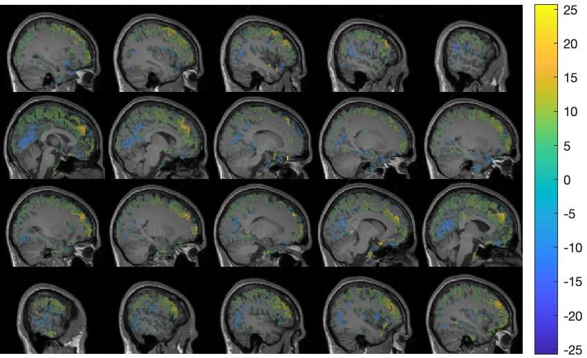
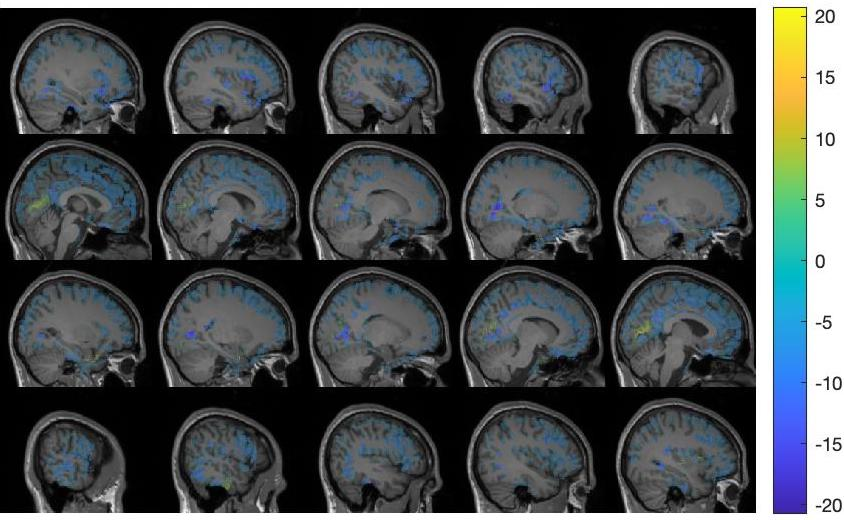

# NeuroPhysViewer
#### Yun Zhao (Monash University, Australia), Email: yun.zhao1@monash.edu

This github package is associated with the manuscript *Space-time resolved inference-basedcwhole-brain imaging of neural mechanisms: application to resting state alpha rhythm*.

## Recommended system requirements
- MATALB version: R2020a or later
- Storage: 10 GB available space

**We recommend that you use a multi-core CPU, as the time efficiency depends on the number of CPU cores in your computer.**

## Installation guide
- To run this demo, you need to install "signal processing toolbox", "statistics and machine learning toolbox", "parallel computing toolbox" in the MATLAB.

- Fieldtrip version equals to or later than 20200828 is also required and available to download from https://www.fieldtriptoolbox.org. Another link is helpful for you to add fieldtrip path to your MATLAB https://www.fieldtriptoolbox.org/faq/should_i_add_fieldtrip_with_all_subdirectories_to_my_matlab_path/.

- After above steps, you download this package (NeuroPhysViewer), unzip and change the current working directory to this package in MATLAB Command Window and run 'defaults', which sets the defaults and configures up the minimal required path settings.

## Demonstration with example data
The example data consists of 4714 MEG-derived source timeseries in the cerebral cortex from subject 21 and is available to download at https://drive.google.com/drive/folders/18EvFR4cr6YfhNUgZaijj9L3M1sG6cusL?usp=sharing. The data is to be put under the directory ‘/data’.

Before running showcases, you need to make sure that the current directory is ‘whole-brain-imaging’. In this directory, you can find a file called ‘test.m’ and this is the script you want to use to run showcases. Note that there are three critical variables in 'test.m' to check before you run the script:
1.	‘pipeline’: put “AKF estimation” or “Contrast imaging” in the list to indicate which showcase to run.
2.	‘ncpu’:  number of CPU cores you want to use. By default, NeuroPhysViewer uses all cores in your CPU.
3.	‘multiple_comparison_correction’:  put 0 or 1 to indicate whether to perform corrections for multiple comparisons problem in Case 2.

#### Case 1: Neurophysiological variables inference by AKF. 
This showcase demonstrates estimating neurophysiological variables in the neural mass model from 4714 MEG-derived source time-series by the AKF. You need to open the MATLAB script ‘test.m’ and put “AKF estimation” in the ‘pipeline’ list. You can run the script by entering the following command in the MATLAB Command Window: ‘test’.  The input to the framework is subject 21 MEG data containing 4714 virtual timeseries and the output is a (.mat) file containing neurophysiological variable estimates for every source point at ‘/output/variable_estimates_21.mat’. There are eight matrices in ‘/output/variable_estimates_21.mat’ and they are the neurophysiological variable estimates for α_ep, α_ip, α_pe, α_pi, μ, v_e, v_i, v_p. Each element contains 4714 rows representing 4714 MEG source points.

#### Case 2: Contrast imaging between strong and weak occipital alpha oscillation. 
This showcase is to image the contrast of neurophysiological variables between when the occipital alpha power is strong and when it is weak. One needs to open the MATLAB script ‘test.m’ and put “Contrast imaging” in the ‘pipeline’ list. The variable ‘multiple_comparison_correction’ toggles between performing corrections for multiple comparisons or not. Note that the correction implemented in this case study is exclusively for individual-level analysis and not the same as what we did in the group-level, but the principal mechanism is the same with group-level analysis. You can then run the script by entering the following command in the MATLAB Command Window: ‘test’. The input to the framework is the neurophysiological variable estimates derived in Case 1 and the output is imaging showing the contrast of neurophysiological variables during strong and weak occipital alpha power. The output images can be found under the directory ‘/demo_cases/contrast_imaging/visualisation_outputs’. Three dimensions to view the brain are provided: lateral, rear, and dorsal view.

#### Note: Case 1 should be run prior to Case 2.

**Case 2 visulisation outputs**
Figure legend    |         Figure snapshot                                                                                                                                                                                                                     
-------------------------------------- |--------------------------------------------------  
Individual-level (subject 21) contrast imaging of the alpha power during times of strong and weak occipital alpha rhythm. The colour bar refers to t-statistics indicating the mean difference between alpha power during strong and weak occipital alpha. Note this figure should not be interpreted in the context of hypothesis testing and only uses the t-statistic as a visualisation tool.           | 
Individual-level (subject 21) contrast imaging of the excitatory to pyramidal connection strength, α_ep, during times of strong and weak occipital alpha rhythm, with corrections for multiple comparisons applied. The colour bar refers to t-statistics indicating the mean difference between connection strength estimates during strong and weak occipital alpha. | 
Individual-level (subject 21) contrast imaging of the inhibitory to pyramidal connection strength, α_ip, during times of strong and weak occipital alpha rhythm, with corrections for multiple comparisons applied. The colour bar refers to t-statistics indicating the mean difference between connection strength estimates during strong and weak occipital alpha. | 
Individual-level (subject 21) contrast imaging of the pyramidal to excitatory connection strength, α_pe, during times of strong and weak occipital alpha rhythm, with corrections for multiple comparisons applied. The colour bar refers to t-statistics indicating the mean difference between connection strength estimates during strong and weak occipital alpha. | 
Individual-level (subject 21) contrast imaging of the pyramidal to inhibitory connection strength, α_pi, during times of strong and weak occipital alpha rhythm, with corrections for multiple comparisons applied. The colour bar refers to t-statistics indicating the mean difference between connection strength estimates during strong and weak occipital alpha. | 
Individual-level (subject 21) contrast imaging of the external cortical input, μ, during times of strong and weak occipital alpha rhythm, with corrections for multiple comparisons applied. The colour bar refers to t-statistics indicating the mean difference between cortical input estimates under strong and weak posterior alpha. | 
Individual-level (subject 21) contrast imaging of the membrane potential of excitatory population, V_e, during times of strong and weak occipital alpha rhythm, with corrections for multiple comparisons applied. The colour bar refers to t-statistics indicating the mean difference between membrane potential estimates under strong and weak posterior alpha. | 
Individual-level (subject 21) contrast imaging of the membrane potential of inhibitory population, V_i, during times of strong and weak occipital alpha rhythm, with corrections for multiple comparisons applied. The colour bar refers to t-statistics indicating the mean difference between membrane potential estimates under strong and weak posterior alpha. | 
Individual-level (subject 21) contrast imaging of the membrane potential of pyramidal population, V_p, during times of strong and weak occipital alpha rhythm, with corrections for multiple comparisons applied. The colour bar refers to t-statistics indicating the mean difference between membrane potential estimates under strong and weak posterior alpha. | 

#### Time efficiency
Here we show basic time statistics of running this framework using a MacBook Pro (Processor 2.9 GHz 6-Core Intel Core i9, Memory 32 GB 2400 MHz DDR4).

"AKF estimation": 3.16 hr on 6 cpus (14.5 seconds each channel)

"Contrast imaging": 1 hr on 6 cpus (with corrections for multiple comparisons); 0.14 hr on 6 cpus (without corrections for multiple comparisons)

## Code reusability
NeuroPhysViewer is an open-source software and all users can use it for research, teaching and learning purposes. We kindly ask you to email us if you want to use it in your publication or integrate it in your toolboxes.

Currently, we offer NeuroPhysViewer as a prototype containing two demo cases in terms of resting state alpha rhythm study: analytic Kalman Filter for neurophysiological variables estimation, whole-brain contrast imaging. In the upcoming updates, we will provide other estimation methods, other visulisation modules, and make it flexible and compatible with various input data.
